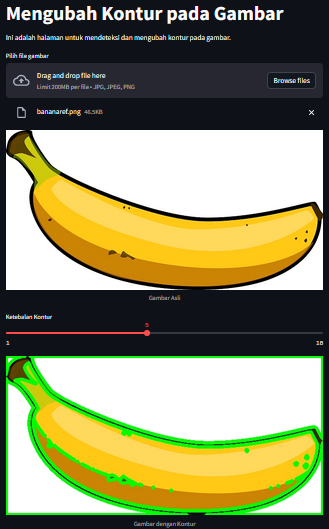

# UTS Pengolahan Citra
| DATA | MAHASISWA |
| -------- | --- |
| **Nama** | Herlan Wibowo|
| **NIM** | 312210324 |
| **Kelas** | TI.22.A3 |

## Cara Menjalankan Project

1. Menginstal Library Python yang dibutuhkan
- Menginstal Library numpy, matplotlib, cv2, streamlit, colorsys dan PIL
   ```
    pip install numpy matplotlib opencv-python streamlit pillow
   ```
2. Menjalankan Project
- Jalankan dengan perintah berikut di terminal
   ```
   streamlit run uts.py
   ```
3. Memilih Fitur yang ingin digunakan
- Pilih fitur pada side bar
- Lalu masukkan gambar yang ingin diubah
  

- Fitur RGB to HSV
  

- Fitur Menampilkan Histogram
  

- Fitur Mengubah Kontras dan Brightness
  

- Fitur Mengubah Contour
  

